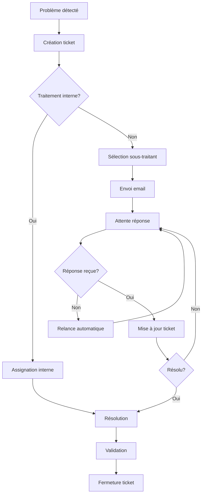

# Cahier des Charges - Application Django de Gestion de Projets et Tickets

## 1. Contexte et Objectifs

### 1.1 Contexte
En tant que Responsable des Systèmes Informatiques (RSI) dans une entreprise de préfabrication, vous collaborez quotidiennement avec plusieurs sous-traitants informatiques. La gestion actuelle par emails génère une perte de suivi des tickets et des résolutions de problèmes, impactant l'efficacité opérationnelle.

### 1.2 Objectifs principaux
- **Centraliser** la gestion des projets informatiques et des incidents
- **Tracer** l'ensemble des communications avec les sous-traitants
- **Optimiser** le suivi des tickets et leur résolution
- **Améliorer** la visibilité sur l'état des projets en cours
- **Automatiser** les relances et notifications

### 1.3 Bénéfices attendus
- Réduction du temps de recherche d'informations
- Amélioration du taux de résolution des tickets
- Meilleur suivi des performances des sous-traitants
- Traçabilité complète des actions menées

## 2. Périmètre Fonctionnel

### 2.1 Modules inclus
- **Gestion des projets** : Création, suivi, association aux sous-traitants
- **Gestion des problèmes/incidents** : Déclaration, priorisation, traitement
- **Gestion des tickets** : Création, assignation, suivi du statut
- **Communication** : Intégration emails, historique des échanges
- **Reporting** : Tableaux de bord, exports, statistiques
- **Notifications** : Rappels automatiques, alertes de délais

### 2.2 Modules exclus
- Gestion multi-utilisateurs
- Authentification complexe (LDAP, SSO)
- API publique
- Interface mobile dédiée
- Intégration ERP/CRM

## 3. Description Détaillée des Fonctionnalités

### 3.1 Module Gestion des Projets

#### 3.1.1 Création de projet
**Champs obligatoires :**
- Nom du projet (unique)
- Description détaillée
- Date de début
- Date de fin prévue
- Statut (Planifié, En cours, En attente, Terminé, Annulé)

**Champs optionnels :**
- Sous-traitant principal
- Budget alloué
- Priorité (Basse, Normale, Haute, Critique)
- Tags/Catégories
- Documents associés (upload de fichiers)

#### 3.1.2 Suivi de projet
- Modification des informations du projet
- Ajout de commentaires/notes avec horodatage
- Association de tickets au projet
- Historique complet des modifications
- Calcul automatique du taux d'avancement

### 3.2 Module Gestion des Problèmes

#### 3.2.1 Déclaration de problème
**Informations requises :**
- Titre du problème
- Description détaillée
- Niveau d'urgence (Faible, Moyen, Élevé, Critique)
- Source du problème (Utilisateur, Monitoring, Maintenance préventive)
- Collaborateur concerné
- Service/Département impacté
- Équipement/Système concerné

**Informations complémentaires :**
- Captures d'écran ou fichiers
- Impact estimé sur l'activité
- Solution temporaire mise en place
- Date/heure de découverte

#### 3.2.2 Traitement du problème
- **Décision de traitement :**
  - Traitement interne (assignation à soi-même)
  - Envoi à un sous-traitant (sélection du prestataire)
  - Mise en attente (avec motif)

- **Workflow de résolution :**
  - Analyse du problème
  - Recherche de solution
  - Test de la solution
  - Mise en production
  - Validation finale

### 3.3 Module Gestion des Tickets

#### 3.3.1 Création automatique
- Génération automatique d'un ticket lors de la déclaration d'un problème
- Numérotation séquentielle (TICK-YYYY-NNNN)
- Attribution automatique des informations du problème

#### 3.3.2 Gestion du cycle de vie
**Statuts disponibles :**
- Nouveau : Ticket créé, non assigné
- Assigné : Ticket attribué à un sous-traitant
- En attente : En attente de retour/information
- En cours : Traitement en cours
- Test : Solution en test
- Résolu : Problème résolu, en attente de validation
- Fermé : Ticket validé et fermé
- Annulé : Ticket annulé (problème non valide)

**Informations de suivi :**
- Date/heure de chaque changement de statut
- Temps passé dans chaque statut
- SLA respecté/dépassé
- Commentaires associés aux changements

### 3.4 Module Communication

#### 3.4.1 Gestion des emails
- **Envoi d'emails :**
  - Composition directe depuis l'application
  - Modèles d'emails prédéfinis par type de problème
  - Insertion automatique des détails du ticket
  - Copie automatique sauvegardée dans le ticket

- **Réception d'emails :**
  - Copier-coller manuel des réponses reçues
  - Association automatique au ticket par numéro de référence
  - Horodatage des réceptions

#### 3.4.2 Historique des communications
- Timeline chronologique de tous les échanges
- Indication de l'expéditeur/destinataire
- Statut de lecture/réponse
- Fichiers joints associés

### 3.5 Module Recherche et Filtrage

#### 3.5.1 Filtres disponibles
- **Par projet :** Sélection d'un ou plusieurs projets
- **Par statut :** Filtrage sur les statuts de tickets
- **Par sous-traitant :** Filtrage par prestataire
- **Par date :** Plage de dates de création/modification
- **Par priorité :** Niveau de priorité
- **Par collaborateur :** Personne concernée par le problème

#### 3.5.2 Recherche textuelle
- Recherche full-text dans les titres et descriptions
- Recherche par numéro de ticket
- Recherche dans les communications
- Sauvegarde des requêtes fréquentes

### 3.6 Module Tableau de Bord

#### 3.6.1 Indicateurs clés (KPI)
- Nombre de tickets ouverts/fermés
- Temps moyen de résolution par sous-traitant
- Tickets en retard de traitement
- Répartition par priorité/statut
- Évolution mensuelle du volume de tickets

#### 3.6.2 Vues synthétiques
- **Vue d'ensemble :** Résumé global de l'activité
- **Vue par projet :** Progression des projets en cours
- **Vue par sous-traitant :** Performance de chaque prestataire
- **Vue urgences :** Tickets critiques et en retard

### 3.7 Module Notifications et Rappels

#### 3.7.1 Règles de notification
- Ticket sans réponse depuis X jours (configurable)
- Ticket critique ouvert depuis plus de 4h
- Projet approchant de sa date de fin
- SLA sur le point d'être dépassé

#### 3.7.2 Moyens de notification
- Notifications dans l'interface (bandeau d'alerte)
- Email de rappel automatique (optionnel)
- Export des tickets en retard pour suivi externe

### 3.8 Module Export et Reporting

#### 3.8.1 Exports disponibles
- **Format PDF :** Rapports formatés avec graphiques
- **Format Excel :** Données brutes pour analyse
- **Format CSV :** Import dans d'autres outils

#### 3.8.2 Types de rapports
- Rapport mensuel d'activité
- Rapport par sous-traitant
- Rapport de performance (SLA, délais)
- Rapport par projet

## 4. Interfaces Utilisateur

### 4.1 Principe de navigation
- Interface basée sur Django Admin personnalisé
- Menu principal avec accès direct aux modules
- Breadcrumb pour situer l'utilisateur
- Interface responsive adaptée écran large

### 4.2 Écrans principaux

#### 4.2.1 Tableau de bord (page d'accueil)
```
+-----------------------------------------------------------+
|  [Logo] Application RSI - Gestion Tickets        [User]  |
+-----------------------------------------------------------+
| Dashboard | Projets | Problèmes | Tickets | Reporting   |
+-----------------------------------------------------------+
| 📊 INDICATEURS CLÉS                                      |
| ┌─────────────┬─────────────┬─────────────┬─────────────┐ |
| │ Tickets     │ En attente  │ Critiques   │ En retard   │ |
| │ ouverts: 12 │ réponse: 5  │ ouverts: 2  │ SLA: 3      │ |
| └─────────────┴─────────────┴─────────────┴─────────────┘ |
|                                                           |
| 🎯 ACTIONS PRIORITAIRES                                   |
| • Ticket #2024-0045 - Serveur mail HS (3j sans réponse) |
| • Projet Migration ERP - Deadline dans 5 jours          |
|                                                           |
| 📈 ÉVOLUTION MENSUELLE                                    |
| [Graphique tickets créés/résolus]                        |
+-----------------------------------------------------------+
```

#### 4.2.2 Liste des tickets
```
+-----------------------------------------------------------+
| 🎫 GESTION DES TICKETS                                    |
+-----------------------------------------------------------+
| [Nouveau ticket] [Recherche: ________] [Filtres ▼]       |
+-----------------------------------------------------------+
| # Ticket    | Titre         | Statut   | Sous-traitant  |
| TICK-2024-  | Serveur mail  | En cours | TechCorp       |
| 0045        | inaccessible  |          |                |
| TICK-2024-  | Mise à jour   | Nouveau  | -              |
| 0046        | antivirus     |          |                |
+-----------------------------------------------------------+
```

#### 4.2.3 Détail d'un ticket
```
+-----------------------------------------------------------+
| TICKET #TICK-2024-0045                    [Modifier]     |
+-----------------------------------------------------------+
| Titre: Serveur mail inaccessible                         |
| Statut: En cours          | Priorité: Élevée            |
| Assigné à: TechCorp       | Créé le: 15/03/2024 09:30   |
| SLA: 2j restants          | Modifié: 16/03/2024 14:15   |
+-----------------------------------------------------------+
| 📝 DESCRIPTION                                            |
| Le serveur de messagerie ne répond plus depuis ce matin. |
| Impact: 50 utilisateurs sans email.                      |
|                                                           |
| 💬 COMMUNICATIONS                                         |
| [16/03 10:00] Email envoyé à TechCorp                    |
| [16/03 14:15] Réponse reçue: "Intervention prévue 17h"   |
|                                                           |
| [Ajouter communication] [Changer statut] [Joindre fichier]|
+-----------------------------------------------------------+
```

### 4.3 Charte graphique
- **Couleurs principales :** Bleu professionnel (#2C3E50), gris clair (#ECF0F1)
- **Couleurs statuts :** 
  - Nouveau: Orange (#F39C12)
  - En cours: Bleu (#3498DB)
  - Résolu: Vert (#27AE60)
  - Critique: Rouge (#E74C3C)
- **Police :** Arial ou équivalent web-safe
- **Icônes :** Font Awesome ou équivalent

## 5. Architecture Technique

### 5.1 Stack technique

#### 5.1.1 Backend
- **Framework :** Django 4.2+ (LTS)
- **Python :** 3.9+
- **Base de données :** PostgreSQL (ou SQLite pour développement)
- **Serveur web :** Nginx + Gunicorn (production)

#### 5.1.2 Frontend
- **Template engine :** Django Templates
- **CSS Framework :** Bootstrap 5
- **JavaScript :** jQuery + Alpine.js (pour interactions légères)
- **Graphiques :** Chart.js
- **Icons :** Font Awesome

#### 5.1.3 Bibliothèques Django recommandées
```python
# requirements.txt
Django>=4.2,<5.0
django-environ>=0.10.0
django-extensions>=3.2.0
django-crispy-forms>=2.0
crispy-bootstrap5>=0.7
django-filter>=23.2
django-tables2>=2.6.0
django-import-export>=3.2.0
Pillow>=10.0.0
reportlab>=4.0.0
openpyxl>=3.1.0
celery>=5.3.0  # pour tâches asynchrones
redis>=4.6.0   # pour cache et Celery
```

### 5.2 Structure de la base de données

#### 5.2.1 Modèles principaux

```python
# models.py (structure simplifiée)

class Contractor(models.Model):
    """Sous-traitant"""
    name = models.CharField(max_length=100)
    contact_email = models.EmailField()
    phone = models.CharField(max_length=20)
    specialties = models.TextField()
    
class Project(models.Model):
    """Projet informatique"""
    name = models.CharField(max_length=200, unique=True)
    description = models.TextField()
    start_date = models.DateField()
    end_date = models.DateField()
    status = models.CharField(max_length=20, choices=STATUS_CHOICES)
    contractor = models.ForeignKey(Contractor, on_delete=models.SET_NULL)
    priority = models.CharField(max_length=10, choices=PRIORITY_CHOICES)
    
class Problem(models.Model):
    """Problème informatique"""
    title = models.CharField(max_length=200)
    description = models.TextField()
    urgency = models.CharField(max_length=10, choices=URGENCY_CHOICES)
    source = models.CharField(max_length=50)
    affected_user = models.CharField(max_length=100)
    affected_service = models.CharField(max_length=100)
    created_at = models.DateTimeField(auto_now_add=True)
    
class Ticket(models.Model):
    """Ticket de suivi"""
    number = models.CharField(max_length=20, unique=True)
    problem = models.OneToOneField(Problem, on_delete=models.CASCADE)
    project = models.ForeignKey(Project, on_delete=models.SET_NULL)
    status = models.CharField(max_length=20, choices=TICKET_STATUS_CHOICES)
    contractor = models.ForeignKey(Contractor, on_delete=models.SET_NULL)
    created_at = models.DateTimeField(auto_now_add=True)
    resolved_at = models.DateTimeField(null=True, blank=True)
    
class Communication(models.Model):
    """Communication liée à un ticket"""
    ticket = models.ForeignKey(Ticket, on_delete=models.CASCADE)
    type = models.CharField(max_length=20)  # email, note, call
    direction = models.CharField(max_length=10)  # sent, received
    subject = models.CharField(max_length=200)
    content = models.TextField()
    timestamp = models.DateTimeField(auto_now_add=True)
```

### 5.3 Organisation du code

```
project_rsi/
├── manage.py
├── requirements.txt
├── config/
│   ├── __init__.py
│   ├── settings/
│   │   ├── base.py
│   │   ├── development.py
│   │   └── production.py
│   ├── urls.py
│   └── wsgi.py
├── apps/
│   ├── core/          # Modèles de base
│   ├── projects/      # Gestion projets
│   ├── tickets/       # Gestion tickets
│   ├── communications/# Gestion emails
│   └── dashboard/     # Tableaux de bord
├── static/
│   ├── css/
│   ├── js/
│   └── img/
├── templates/
│   ├── base.html
│   ├── dashboard/
│   ├── tickets/
│   └── projects/
└── media/            # Fichiers uploadés
```

## 6. Contraintes Techniques

### 6.1 Contraintes de développement
- **Utilisateur unique :** Pas de gestion multi-utilisateurs complexe
- **Authentification simple :** Session basique Django
- **Pas d'API REST :** Interface web uniquement
- **Performance :** Optimisé pour quelques centaines de tickets
- **Sécurité :** Standard Django (CSRF, XSS protection)

### 6.2 Contraintes d'infrastructure
- **Hébergement :** Serveur local ou VPS basique
- **Base de données :** PostgreSQL recommandé, SQLite acceptable
- **Sauvegarde :** Script de backup automatique recommandé
- **Monitoring :** Logs Django standards

### 6.3 Contraintes fonctionnelles
- **Import de données :** Pas de migration automatique depuis l'existant
- **Intégration email :** Copier-coller manuel acceptable
- **Temps réel :** Pas de WebSocket, rechargement manuel des pages
- **Mobile :** Interface responsive mais optimisée desktop

## 7. Suggestions d'Évolutions Futures

### 7.1 Phase 2 - Améliorations court terme (3-6 mois)
- **Intégration IMAP/SMTP :** Synchronisation automatique des emails
- **API REST :** Exposition des données pour intégration future
- **Workflow avancé :** Règles métier configurables
- **Templates d'emails :** Personnalisation poussée des modèles

### 7.2 Phase 3 - Évolutions moyen terme (6-12 mois)
- **Application mobile :** Version responsive avancée ou PWA
- **Intelligence artificielle :** Catégorisation automatique des problèmes
- **Intégration ERP :** Connexion avec le système de gestion existant
- **Multi-utilisateurs :** Extension pour équipe IT

### 7.3 Phase 4 - Vision long terme (1-2 ans)
- **Analytics avancées :** Machine learning pour prédiction de pannes
- **Chatbot :** Assistant virtuel pour création de tickets
- **API publique :** Intégration avec outils tiers (Slack, Teams)
- **Audit complet :** Conformité RGPD et sécurité renforcée

## 8. Annexes et Maquettes

### 8.1 Workflow de traitement d'un ticket



### 8.2 Exemple de modèle d'email

```
Objet: [TICKET #{number}] {problem_title}

Bonjour,

Nous rencontrons le problème suivant :

**Problème :** {problem_title}
**Description :** {problem_description}
**Urgence :** {urgency_level}
**Impact :** {affected_users} utilisateurs concernés

**Contexte technique :**
{technical_details}

Pourriez-vous nous faire un retour sur ce problème et nous indiquer les mesures que vous comptez prendre ?

Merci de conserver le numéro de ticket {number} dans vos réponses.

Cordialement,
{user_name}
RSI - {company_name}
```

### 8.3 Configuration des SLA par priorité

| Priorité | Temps de réponse | Temps de résolution | Rappel automatique |
|----------|------------------|---------------------|-------------------|
| Critique | 2 heures         | 4 heures           | Toutes les heures |
| Élevée   | 4 heures         | 1 jour             | Tous les jours    |
| Normale  | 1 jour           | 3 jours            | Tous les 2 jours  |
| Basse    | 2 jours          | 1 semaine          | Toutes les semaines |

## 9. Utilisation Mono-Utilisateur

### 9.1 Simplifications apportées
- **Pas d'authentification complexe :** Session simple avec login/logout basique
- **Pas de gestion des droits :** Accès total à toutes les fonctionnalités
- **Pas de notifications multi-canaux :** Interface web uniquement
- **Configuration globale :** Paramètres stockés en base, pas par utilisateur

### 9.2 Optimisations mono-utilisateur
- **Interface personnalisable :** Widgets dashboard déplaçables
- **Raccourcis clavier :** Navigation rapide entre les écrans
- **Favoris et historique :** Accès rapide aux tickets récents
- **Auto-complétion :** Suggestion basée sur l'historique personnel

### 9.3 Paramètres utilisateur
```python
class UserSettings(models.Model):
    """Configuration globale utilisateur unique"""
    default_contractor = models.ForeignKey(Contractor)
    notification_delay_days = models.IntegerField(default=3)
    tickets_per_page = models.IntegerField(default=20)
    default_ticket_priority = models.CharField(default='normale')
    email_signature = models.TextField()
    company_name = models.CharField(max_length=100)
```

## 10. Auto-Développement

### 10.1 Phases de développement recommandées

#### Phase 1 - MVP (2-3 semaines)
1. **Setup projet Django** avec structure de base
2. **Modèles de données** : Ticket, Problem, Contractor
3. **CRUD basique** : Création/modification tickets
4. **Interface Django Admin** personnalisée
5. **Tests unitaires** de base

#### Phase 2 - Fonctionnalités core (3-4 semaines)
1. **Dashboard** avec indicateurs clés
2. **Système de statuts** et workflow
3. **Module communications** (manuel)
4. **Recherche et filtres** avancés
5. **Export PDF/Excel** basique

#### Phase 3 - Optimisations (2-3 semaines)
1. **Notifications** et rappels automatiques
2. **Interface utilisateur** optimisée
3. **Graphiques** et reporting
4. **Tests d'intégration** complets
5. **Documentation** utilisateur

### 10.2 Outils de développement recommandés

#### IDE et environnement
- **PyCharm Community** ou **VSCode** avec extensions Python/Django
- **Git** pour versioning
- **Docker** pour environnement de développement isolé
- **Makefile** pour automatisation des tâches

#### Testing et qualité
```python
# Tests recommandés
pytest-django>=4.5.0
coverage>=7.2.0
black>=23.0.0      # formatage code
flake8>=6.0.0      # linting
pre-commit>=3.3.0  # hooks Git
```

#### Debug et monitoring
```python
django-debug-toolbar>=4.1.0  # debug en développement
django-extensions>=3.2.0     # commandes utiles
sentry-sdk>=1.28.0           # monitoring erreurs (optionnel)
```

### 10.3 Checklist de déploiement

**Pré-production :**
- [ ] Variables d'environnement configurées
- [ ] Base de données migrée
- [ ] Fichiers statiques collectés
- [ ] Tests passent à 100%
- [ ] Sauvegarde automatique configurée

**Production :**
- [ ] Serveur web configuré (Nginx)
- [ ] HTTPS activé
- [ ] Logs rotatifs configurés
- [ ] Monitoring basique en place
- [ ] Documentation d'exploitation rédigée

---

**Document établi pour :** RSI Entreprise de Préfabrication  
**Version :** 1.0  
**Date :** Juillet 2025  
**Auteur :** Spécifications techniques auto-développement Django