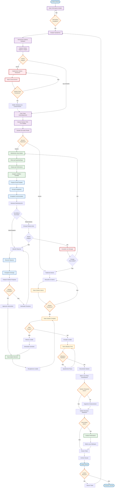

```mermaid
flowchart TD
    %% Début du processus
    START([Incident Detecte]) --> INPUT[Saisir Informations Incident]
    
    %% Saisie initiale
    INPUT --> VALIDATE{Informations\nCompletes?}
    VALIDATE -->|Non| INPUT
    VALIDATE -->|Oui| ANALYZE[Analyser Symptomes]
    
    %% Analyse et diagnostic
    ANALYZE --> SEARCH[Rechercher Incidents Similaires]
    SEARCH --> CALC_CRIT[Calculer Criticite\nUrgence x Impact]
    
    %% Évaluation criticité
    CALC_CRIT --> CRITICAL{Criticite\nCritique?}
    
    %% Chemin critique - Solution temporaire obligatoire
    CRITICAL -->|Oui P1| TEMP_SOL[Implementer Solution Temporaire]
    TEMP_SOL --> TEST_TEMP[Tester Contournement]
    TEST_TEMP --> TEMP_OK{Solution Temp\nFonctionne?}
    TEMP_OK -->|Non| TEMP_SOL
    TEMP_OK -->|Oui| NOTIFY_USERS[Notifier Utilisateurs du Contournement]
    NOTIFY_USERS --> CREATE_TICKET
    
    %% Chemin normal
    CRITICAL -->|Non P2/P3/P4| CREATE_TICKET[Creer Ticket Automatiquement]
    
    %% Génération ticket
    CREATE_TICKET --> GEN_NUM[Generer Numero TICK-YYYY-NNNN]
    GEN_NUM --> CALC_SLA[Calculer SLA selon Priorite]
    CALC_SLA --> DECIDE{Decision\nTraitement?}
    
    %% Point de décision traitement
    DECIDE -->|Interne| INTERNAL[Traitement Interne]
    DECIDE -->|Externe| SELECT_CONTRACTOR[Selectionner Sous-traitant]
    
    %% Traitement interne
    INTERNAL --> INTERNAL_WORK[Resoudre en Interne]
    INTERNAL_WORK --> INTERNAL_TEST[Tester Solution Interne]
    INTERNAL_TEST --> INTERNAL_OK{Solution\nFonctionne?}
    INTERNAL_OK -->|Non| INTERNAL_WORK
    INTERNAL_OK -->|Oui| VALIDATE_SOLUTION
    
    %% Sélection sous-traitant
    SELECT_CONTRACTOR --> FILTER[Filtrer par Expertise/Dispo]
    FILTER --> RANK[Classer par Performance]
    RANK --> ASSIGN[Assigner a Meilleur Candidat]
    
    %% Communication sous-traitant
    ASSIGN --> PREP_EMAIL[Preparer Email Template]
    PREP_EMAIL --> SEND_EMAIL[Envoyer Assignation]
    SEND_EMAIL --> LOG_COMM[Enregistrer Communication]
    LOG_COMM --> START_MONITOR[Demarrer Monitoring SLA]
    
    %% Processus parallèle - Monitoring SLA
    START_MONITOR --> MONITOR{Surveillance\nSLA Active}
    MONITOR -->|Delai Respecte| WAIT_RESPONSE[Attendre Reponse]
    MONITOR -->|Retard Detecte| SEND_REMINDER[Envoyer Relance Auto]
    SEND_REMINDER --> ESCALATE{Retard\nCritique?}
    ESCALATE -->|Oui| ESCALATE_MANAGER[Escalader vers Manager]
    ESCALATE -->|Non| WAIT_RESPONSE
    ESCALATE_MANAGER --> CHANGE_CONTRACTOR{Changer\nSous-traitant?}
    CHANGE_CONTRACTOR -->|Oui| SELECT_CONTRACTOR
    CHANGE_CONTRACTOR -->|Non| INTERNAL
    
    %% Réception réponse sous-traitant
    WAIT_RESPONSE --> RECEIVE_RESPONSE[Recevoir Reponse]
    RECEIVE_RESPONSE --> LOG_RESPONSE[Enregistrer Echange]
    LOG_RESPONSE --> ANALYZE_RESPONSE[Analyser Solution Proposee]
    ANALYZE_RESPONSE --> SOLUTION_OK{Solution\nAcceptable?}
    
    %% Validation solution sous-traitant
    SOLUTION_OK -->|Non| REQUEST_CLARIF[Demander Precisions]
    REQUEST_CLARIF --> WAIT_RESPONSE
    SOLUTION_OK -->|Oui| APPROVE_SOLUTION[Approuver Intervention]
    APPROVE_SOLUTION --> CONTRACTOR_WORK[Sous-traitant Intervient]
    CONTRACTOR_WORK --> RECEIVE_DELIVERY[Receptionner Livrable]
    
    %% Test et validation finale
    RECEIVE_DELIVERY --> VALIDATE_SOLUTION[Tester Solution Complete]
    VALIDATE_SOLUTION --> FINAL_TEST{Tests\nPasses?}
    
    %% Boucle de correction si tests échouent
    FINAL_TEST -->|Non| REJECT_SOLUTION[Refuser Livrable]
    REJECT_SOLUTION --> REQUEST_FIX[Demander Correction]
    REQUEST_FIX --> CONTRACTOR_WORK
    
    %% Acceptation et finalisation
    FINAL_TEST -->|Oui| ACCEPT_SOLUTION[Accepter Livrable]
    ACCEPT_SOLUTION --> USER_TEST[Tests Utilisateur Final]
    USER_TEST --> USER_OK{Utilisateurs\nSatisfaits?}
    USER_OK -->|Non| FINAL_ADJUST[Ajustements Finaux]
    FINAL_ADJUST --> USER_TEST
    USER_OK -->|Oui| DOCUMENT[Documenter Solution]
    
    %% Documentation et clôture
    DOCUMENT --> UPDATE_KB[Mettre a jour Base Connaissance]
    UPDATE_KB --> REMOVE_TEMP{Solution Temporaire\nActive?}
    REMOVE_TEMP -->|Oui| REMOVE_WORKAROUND[Supprimer Contournement]
    REMOVE_TEMP -->|Non| NOTIFY_RESOLUTION
    REMOVE_WORKAROUND --> NOTIFY_RESOLUTION[Notifier Resolution Utilisateurs]
    
    %% Évaluation et fermeture
    NOTIFY_RESOLUTION --> EVAL_CONTRACTOR{Sous-traitant\nUtilise?}
    EVAL_CONTRACTOR -->|Oui| RATE_PERFORMANCE[Evaluer Performance]
    EVAL_CONTRACTOR -->|Non| CLOSE_TICKET
    RATE_PERFORMANCE --> UPDATE_METRICS[Mettre a jour Metriques]
    UPDATE_METRICS --> CLOSE_TICKET[Fermer Ticket]
    
    %% Finalisation
    CLOSE_TICKET --> ARCHIVE[Archiver Dossier]
    ARCHIVE --> END([Incident Resolu])
    
    %% Processus de réouverture possible
    END --> REOPEN{Incident\nRecours?}
    REOPEN -->|Oui| REOPEN_TICKET[Rouvrir Ticket]
    REOPEN_TICKET --> ANALYZE
    REOPEN -->|Non| FINAL_END([Processus Termine])
    
    %% Styles pour différents types d'activités
    classDef startEnd fill:#e1f5fe,stroke:#01579b,stroke-width:3px
    classDef process fill:#f3e5f5,stroke:#4a148c,stroke-width:2px
    classDef decision fill:#fff3e0,stroke:#e65100,stroke-width:2px
    classDef critical fill:#ffebee,stroke:#b71c1c,stroke-width:3px
    classDef contractor fill:#e8f5e8,stroke:#1b5e20,stroke-width:2px
    classDef test fill:#fff8e1,stroke:#f57f17,stroke-width:2px
    classDef communication fill:#e3f2fd,stroke:#0d47a1,stroke-width:2px
    
    %% Application des styles
    class START,END,FINAL_END startEnd
    class INPUT,ANALYZE,SEARCH,CALC_CRIT,CREATE_TICKET,GEN_NUM,CALC_SLA process
    class VALIDATE,CRITICAL,DECIDE,TEMP_OK,INTERNAL_OK,SOLUTION_OK,FINAL_TEST,USER_OK,REMOVE_TEMP,EVAL_CONTRACTOR,REOPEN decision
    class TEMP_SOL,TEST_TEMP,ESCALATE_MANAGER critical
    class SELECT_CONTRACTOR,FILTER,RANK,ASSIGN,CONTRACTOR_WORK,RATE_PERFORMANCE contractor
    class INTERNAL_TEST,VALIDATE_SOLUTION,USER_TEST test
    class PREP_EMAIL,SEND_EMAIL,LOG_COMM,RECEIVE_RESPONSE,LOG_RESPONSE communication

```