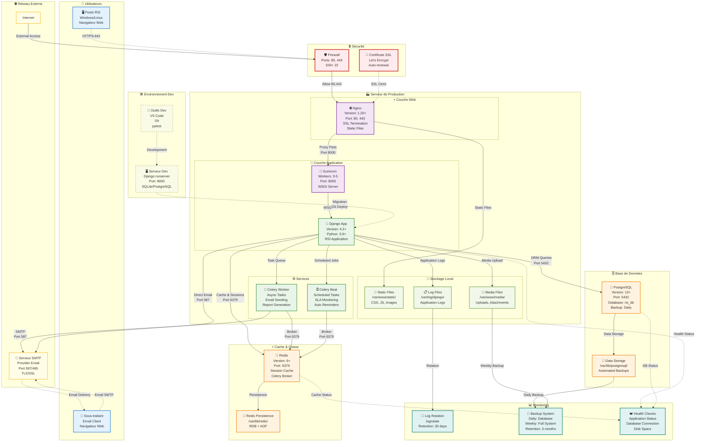

```mermaid
flowchart TB
    %% Définition des utilisateurs
    subgraph USERS ["👥 Utilisateurs"]
        RSI["🖥️ Poste RSI<br/>Windows/Linux<br/>Navigateur Web"]
        CONTRACTOR["💼 Sous-traitant<br/>Email Client<br/>Navigateur Web"]
    end
    
    %% Couche réseau externe
    subgraph EXTERNAL ["🌐 Réseau Externe"]
        INTERNET["Internet"]
        SMTP_PROVIDER["📧 Serveur SMTP<br/>Provider Email<br/>Port 587/465<br/>TLS/SSL"]
    end
    
    %% Firewall et sécurité
    subgraph SECURITY ["🔒 Sécurité"]
        FIREWALL["🛡️ Firewall<br/>Ports: 80, 443<br/>SSH: 22"]
        SSL_CERT["🔐 Certificats SSL<br/>Let's Encrypt<br/>Auto-renewal"]
    end
    
    %% Serveur principal de production
    subgraph PRODUCTION ["🏭 Serveur de Production"]
        
        %% Couche Web
        subgraph WEB_LAYER ["⚡ Couche Web"]
            NGINX["🌐 Nginx<br/>Version: 1.20+<br/>Port: 80, 443<br/>SSL Termination<br/>Static Files"]
        end
        
        %% Couche Application
        subgraph APP_LAYER ["🐍 Couche Application"]
            GUNICORN["🦄 Gunicorn<br/>Workers: 3-5<br/>Port: 8000<br/>WSGI Server"]
            DJANGO["🎯 Django App<br/>Version: 4.2+<br/>Python: 3.9+<br/>RSI Application"]
        end
        
        %% Couche Services
        subgraph SERVICES_LAYER ["⚙️ Services"]
            CELERY_WORKER["👷 Celery Worker<br/>Async Tasks<br/>Email Sending<br/>Report Generation"]
            CELERY_BEAT["⏰ Celery Beat<br/>Scheduled Tasks<br/>SLA Monitoring<br/>Auto Reminders"]
        end
        
        %% Stockage local
        subgraph STORAGE ["💾 Stockage Local"]
            STATIC_FILES["📁 Static Files<br/>/var/www/static/<br/>CSS, JS, Images"]
            MEDIA_FILES["📎 Media Files<br/>/var/www/media/<br/>Uploads, Attachments"]
            LOG_FILES["📋 Log Files<br/>/var/log/django/<br/>Application Logs"]
        end
    end
    
    %% Base de données
    subgraph DATABASE ["🗄️ Base de Données"]
        POSTGRES["🐘 PostgreSQL<br/>Version: 13+<br/>Port: 5432<br/>Database: rsi_db<br/>Backup: Daily"]
        POSTGRES_DATA["💽 Data Storage<br/>/var/lib/postgresql/<br/>Automated Backups"]
    end
    
    %% Cache et Queue
    subgraph CACHE_QUEUE ["⚡ Cache & Queue"]
        REDIS["🔴 Redis<br/>Version: 6+<br/>Port: 6379<br/>Session Cache<br/>Celery Broker"]
        REDIS_DATA["💾 Redis Persistence<br/>/var/lib/redis/<br/>RDB + AOF"]
    end
    
    %% Monitoring et logs
    subgraph MONITORING ["📊 Monitoring"]
        LOG_ROTATION["🔄 Log Rotation<br/>logrotate<br/>Retention: 30 days"]
        BACKUP_SYSTEM["💾 Backup System<br/>Daily: Database<br/>Weekly: Full System<br/>Retention: 3 months"]
        HEALTH_CHECK["❤️ Health Checks<br/>Application Status<br/>Database Connection<br/>Disk Space"]
    end
    
    %% Environnement de développement
    subgraph DEVELOPMENT ["🛠️ Environnement Dev"]
        DEV_SERVER["🖥️ Serveur Dev<br/>Django runserver<br/>Port: 8000<br/>SQLite/PostgreSQL"]
        DEV_TOOLS["🔧 Outils Dev<br/>VS Code<br/>Git<br/>pytest"]
    end
    
    %% Connexions utilisateurs vers système
    RSI -.->|HTTPS:443| FIREWALL
    CONTRACTOR -.->|Email SMTP| SMTP_PROVIDER
    
    %% Firewall vers serveur web
    FIREWALL -->|Allow 80,443| NGINX
    SSL_CERT -.->|SSL Certs| NGINX
    
    %% Flux web principal
    NGINX -->|Proxy Pass<br/>Port 8000| GUNICORN
    GUNICORN -->|WSGI| DJANGO
    
    %% Connexions base de données
    DJANGO -->|ORM Queries<br/>Port 5432| POSTGRES
    POSTGRES -->|Data Storage| POSTGRES_DATA
    
    %% Connexions cache et sessions
    DJANGO -->|Cache & Sessions<br/>Port 6379| REDIS
    REDIS -->|Persistence| REDIS_DATA
    
    %% Services asynchrones
    DJANGO -->|Task Queue| CELERY_WORKER
    DJANGO -->|Scheduled Jobs| CELERY_BEAT
    CELERY_WORKER -->|Broker<br/>Port 6379| REDIS
    CELERY_BEAT -->|Broker<br/>Port 6379| REDIS
    
    %% Email sortant
    CELERY_WORKER -->|SMTP<br/>Port 587| SMTP_PROVIDER
    DJANGO -->|Direct Email<br/>Port 587| SMTP_PROVIDER
    
    %% Stockage fichiers
    NGINX -->|Static Files| STATIC_FILES
    DJANGO -->|Media Upload| MEDIA_FILES
    DJANGO -->|Application Logs| LOG_FILES
    
    %% Monitoring et maintenance
    LOG_FILES -->|Rotation| LOG_ROTATION
    POSTGRES_DATA -->|Daily Backup| BACKUP_SYSTEM
    MEDIA_FILES -->|Weekly Backup| BACKUP_SYSTEM
    DJANGO -.->|Health Status| HEALTH_CHECK
    POSTGRES -.->|DB Status| HEALTH_CHECK
    REDIS -.->|Cache Status| HEALTH_CHECK
    
    %% Connexions développement
    DEV_SERVER -.->|Migration<br/>Git Deploy| DJANGO
    DEV_TOOLS -.->|Development| DEV_SERVER
    
    %% Configuration réseau et sécurité
    INTERNET -->|External Access| FIREWALL
    SMTP_PROVIDER -.->|Email Delivery| CONTRACTOR
    
    %% Styles pour différents types de composants
    classDef userStyle fill:#e3f2fd,stroke:#1976d2,stroke-width:2px
    classDef webStyle fill:#f3e5f5,stroke:#7b1fa2,stroke-width:2px
    classDef appStyle fill:#e8f5e8,stroke:#388e3c,stroke-width:2px
    classDef dataStyle fill:#fff3e0,stroke:#f57c00,stroke-width:2px
    classDef serviceStyle fill:#fce4ec,stroke:#c2185b,stroke-width:2px
    classDef securityStyle fill:#ffebee,stroke:#d32f2f,stroke-width:3px
    classDef storageStyle fill:#f1f8e9,stroke:#689f38,stroke-width:2px
    classDef monitoringStyle fill:#e0f2f1,stroke:#00796b,stroke-width:2px
    classDef externalStyle fill:#fffde7,stroke:#fbc02d,stroke-width:2px
    classDef devStyle fill:#f9fbe7,stroke:#827717,stroke-width:1px,stroke-dasharray: 5 5
    
    %% Application des styles
    class RSI,CONTRACTOR userStyle
    class NGINX,GUNICORN webStyle
    class DJANGO,CELERY_WORKER,CELERY_BEAT appStyle
    class POSTGRES,POSTGRES_DATA,REDIS,REDIS_DATA dataStyle
    class FIREWALL,SSL_CERT securityStyle
    class STATIC_FILES,MEDIA_FILES,LOG_FILES storageStyle
    class LOG_ROTATION,BACKUP_SYSTEM,HEALTH_CHECK monitoringStyle
    class SMTP_PROVIDER,INTERNET externalStyle
    class DEV_SERVER,DEV_TOOLS devStyle
```